# Crop insurance claim risk in Brazil

[](https://github.com/caiogoia123/crop-insurance-risk/actions/workflows/ci.yml)
· [Português](README.pt-BR.md)

Claim model for 1.5 million subsidized crop insurance policies (PSR, 2006-2024),
with NASA POWER climate, walk-forward validation by crop season and an API running
on a free Oracle VM.

## TL;DR

**Question:** given a crop insurance policy, what is the probability that it will be
indemnified? How much does climate improve that prediction over contract data
alone? Does the model rank risk better than the rate the insurer charged?

**Three numbers** (11 test seasons, 2013/14 to 2023/24, 1,157,908 policies, each
season scored by models trained only on earlier seasons):

1. **Pre-season model vs the insurer's rate: AUC 0.646 vs 0.625.** The model ranks
   better in 7 of 11 seasons, but the gain is small: with a realistic one-season
   delay in claim data it is 0.635, and the confidence interval includes zero.
2. **Climate at contract time adds nothing measurable** (1981-2005 climatology and
   ENSO: +0.002 AUC). **Weather observed during the season adds +0.06 AUC** (LightGBM
   0.695 vs 0.633, better in 10 of 11 seasons).
3. **The model has information the price does not.** Sorting policies by model risk /
   risk implied by the rate, the loss ratio goes from **0.49** in the bottom decile to **1.45** in the top
   one, while the rate charged stays almost flat (6.5% to 9.5%).

**API:** https://caiogoia.duckdns.org/crop-risk/ (form) ·
[docs](https://caiogoia.duckdns.org/crop-risk/docs) ·
[model-info](https://caiogoia.duckdns.org/crop-risk/model-info)

## Results

### Backtest

Walk-forward by safra (Aug-Jul crop season): each test season is scored by models
trained on all earlier seasons; hyperparameters were chosen once, on 2009-2012.
AUC, KS, Gini, PR-AUC and Brier are means over the 11 test seasons.
"AUC within crop" ranks policies inside the same crop group and season, which is
where an insurer's price differentiates farmers.

| Model | AUC (sd) | worst season | KS | PR-AUC | Brier | AUC within crop | seasons > rate |
|---|---|---|---|---|---|---|---|
| Mean claim rate (constant) | 0.500 | 0.500 | 0.000 | 0.168 | 0.1414 | 0.500 | - |
| **Insurer's rate (`PE_TAXA`)** | **0.625** (0.080) | 0.510 | 0.245 | 0.228 | **0.1388** | 0.579 | - |
| Logistic, contract + history | 0.644 (0.057) | 0.555 | 0.255 | 0.243 | 0.1405 | 0.585 | 7/11 |
| LightGBM, contract only | 0.622 (0.084) | 0.505 | 0.205 | 0.224 | 0.1467 | 0.591 | 4/11 |
| LightGBM, contract + history | 0.638 (0.085) | 0.487 | 0.225 | 0.247 | 0.1450 | **0.622** | 6/11 |
| **Logistic, pre-season (served)** | **0.646** (0.058) | **0.562** | 0.248 | 0.245 | 0.1398 | 0.593 | 7/11 |
| LightGBM, pre-season | 0.633 (0.111) | 0.391 | 0.273 | 0.248 | 0.1404 | 0.597 | 7/11 |
| LightGBM, pre-season + insurer's rate | 0.643 (0.106) | 0.433 | 0.277 | 0.253 | 0.1397 | 0.606 | 7/11 |
| Logistic, in-season | 0.683 (0.072) | 0.580 | 0.305 | 0.283 | 0.1338 | 0.624 | 9/11 |
| **LightGBM, in-season** | **0.695** (0.069) | 0.558 | **0.307** | **0.299** | 0.1344 | **0.663** | 9/11 |
| LightGBM, end of critical window | 0.690 (0.073) | 0.595 | 0.298 | 0.294 | 0.1362 | 0.663 | 10/11 |

*Pre-season* = contract + portfolio history + climatology + ENSO, known when the
policy is signed. *In-season* = pre-season + weather observed from the start to the
middle of the crop's critical window (early warning). Gini = 2·AUC - 1. Full tables,
paired differences with confidence intervals and sensitivity runs:
[`reports/results.md`](reports/results.md).

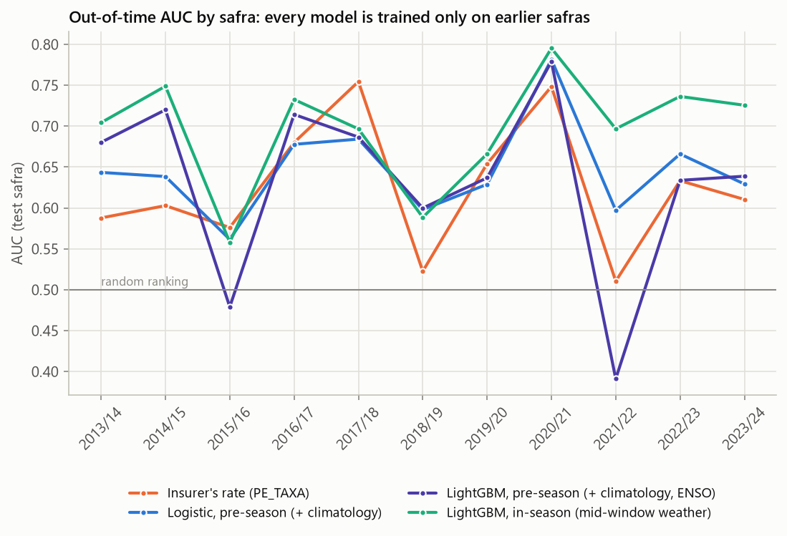

### Does climate help?

- **Climate known at contract time: no.** Adding the 1981-2005 climatology of the
  critical window and the ENSO index to contract + history changes AUC by +0.002
  (logistic, 95% CI -0.008 to +0.011) and -0.005 (LightGBM). The municipality's loss
  history already says where droughts usually hit. SHAP shows the LightGBM model does
  use the climatology (32% of the attribution), but as a substitute for location and
  history, not as new information.
- **Weather observed during the season: yes.** Rain, dry-spell, heat, frost and
  soil-moisture anomalies up to the middle of the window lift AUC from 0.633 to 0.695
  (LightGBM, 10 of 11 seasons, 95% CI +0.004 to +0.122) and the top-decile lift from
  1.6 to 2.1. The gain is largest in drought years: in 2021/22 the pre-season models
  fall to 0.39-0.60 and the in-season LightGBM holds 0.70.
- By cause of loss (AUC of claims of each cause against policies without a claim):
  drought 0.61 pre-season (logistic) and 0.68 in-season; hail 0.72-0.79 and frost
  0.77-0.79 with or without season weather (they depend on what is planted where,
  which the contract already says); excess rain 0.55 for every model.

### Does the model beat the insurer's rate?

- **Ranking across the whole portfolio: slightly, not reliably.** The served
  logistic model averages 0.646 vs 0.625 (+0.020, 95% CI -0.010 to +0.052, 7 of 11
  seasons). The rate wins in 2017/18 and 2019/20. With a one-season gap between
  training and scoring, which is closer to how a price is set before the last
  season's claims are closed, the advantage shrinks to +0.009 (0.635 vs 0.625,
  95% CI -0.024 to +0.042, still 7 of 11 seasons).
- **Inside each crop: yes.** The rate is set mostly by crop, region and product;
  inside a crop group and season the LightGBM contract + history model reaches 0.622
  vs 0.579 for the rate (coffee 0.74 vs 0.64, soy 0.63 vs 0.58).
- **Calibration: no.** The rate, mapped to a probability with a logistic fit on past
  seasons, has the best Brier score among contract-time models (0.1388 vs 0.1398).
- **Pricing signal:** the double-lift table sorts policies by model risk divided by
  the rate-implied risk. Where the model sees more risk than the price, claims are
  three times as frequent (28.4% vs 9.2%) and the loss ratio is 1.45 vs 0.49, while
  the rate charged is about the same. So the model carries information the price
  does not.

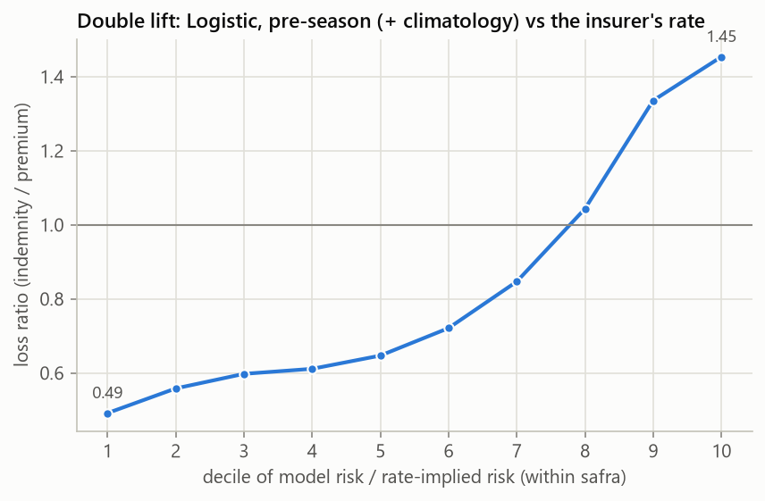

### Lift, KS and loss ratio by decile

Deciles are computed inside each season, then pooled.

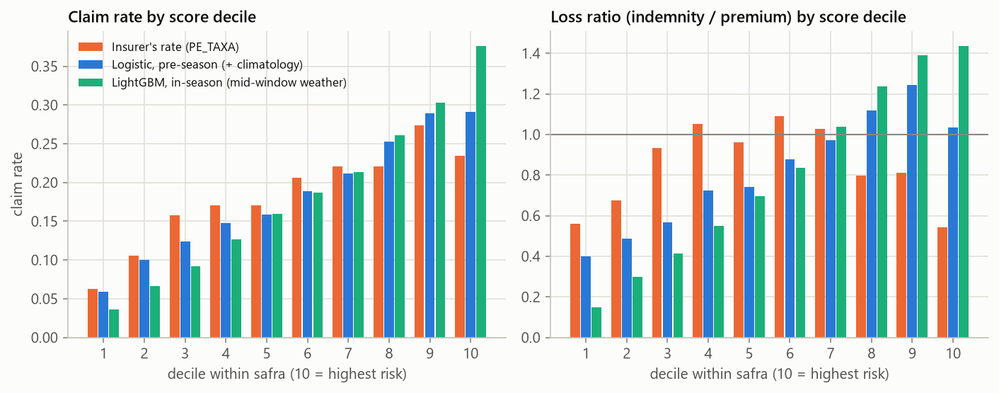
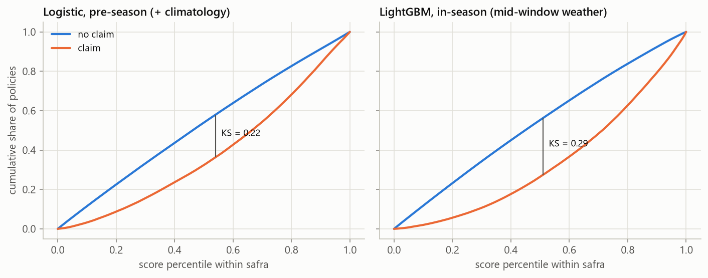

### Calibration: the models rank, they do not forecast the season

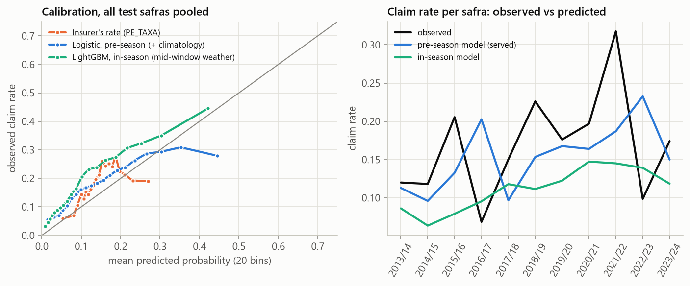

The left panel pools all test seasons; the right one compares the observed claim
rate of each season with the mean prediction. Claim rates swing from 7% (2016/17) to
32% (2021/22). The pre-season model cannot know the season's weather; its mean
prediction partly follows the previous season (20% predicted for 2016/17, observed 7%;
23% for 2022/23, observed 10%) through the history and ENSO features. The in-season model ranks the 2021/22 drought well
(AUC 0.70) but still predicts a 14.5% mean claim rate for a 32% season: the size of
the shock is larger than anything the trees saw in the same position. Use the
scores to rank and to flag, not as a forecast of the season's total claims.

Score PSI between training and test seasons is above 0.25 in most seasons for both
models. Here that is expected and not a bug: each season has one ENSO state, a
different crop mix and a different subsidy budget (42k policies in 2015/16, 199k in
2021/22). Monitoring should compare PSI between seasons, not apply the usual 0.25
alarm.

### What drives the scores (SHAP, LightGBM, test season 2023/24)

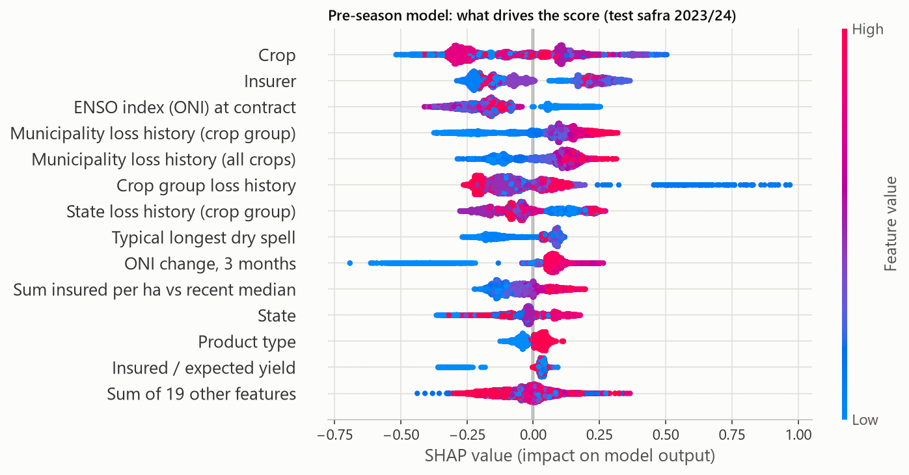
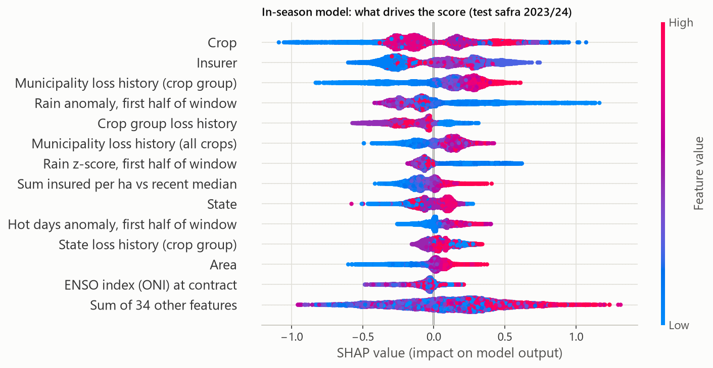

Pre-season: crop, insurer, ENSO and the municipality's loss history lead. In-season:
the rain anomaly in the first half of the window enters the top four, and season
weather takes 29% of the attribution.

## Climate data quality: INMET stations vs NASA POWER

The models use NASA POWER (a gap-free gridded product). To show why, and what it
costs, `croprisk.quality.inmet` compares it with the 95 INMET automatic stations in
PR, SC and RS for 2021-2022:

- **Gaps are the rule, not the exception.** The median station has no valid daily
  rain total on 23% of days; 64 of 95 stations miss more than 10% of days.
- **Zero rain or missing data?** A day counts as measured only with 22+ valid hourly
  values; a naive daily sum turns missing hours into 0 mm and would have created
  21,779 fake dry station-days, which a model would read as drought. Runs of 30+
  days of exact zeros while neighbours received 60+ mm are flagged as a stuck sensor
  (39 days at 1 station).
- **Filling gaps with neighbours (IDW, power 2, 150 km, 2+ stations):** validated by
  leaving each measured day out, daily MAE 2.8 mm, correlation 0.77, total bias +0.5%,
  89% of rain days detected. It filled 19,428 station-days; 4,045 had no neighbours
  with data.
- **NASA POWER against the stations:** daily correlation 0.75 (about the same as IDW
  from neighbours), monthly 0.91; POWER has 8% less rain in total and more drizzle
  days (35% of its rain days are dry at the station); minimum temperature correlation
  0.95, bias -0.1 C. Good enough for seasonal anomalies; not for daily, farm-level work.

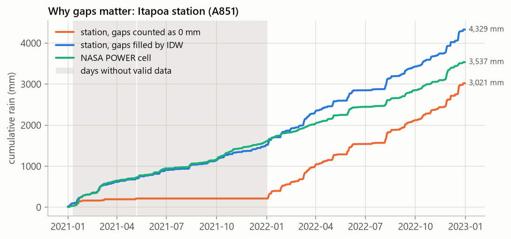
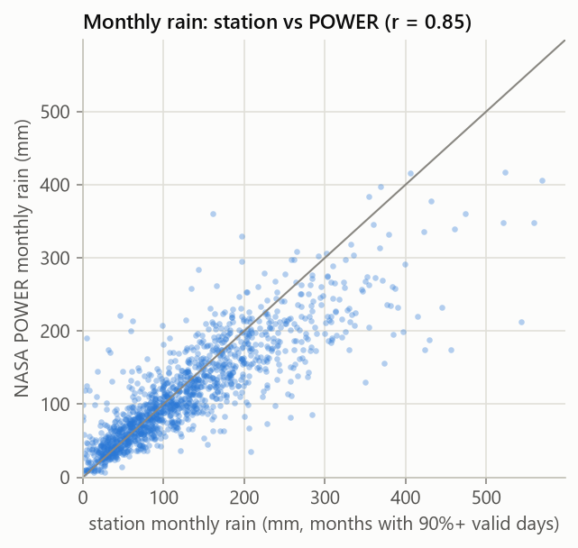

## Extra: do claim waves precede rural-credit default?

`croprisk.analysis.scr_credit` joins the claim rate per UF and season with the BCB
SCR.data portfolio of crop loans (custeio, Jul 2012 to Dec 2025). Across 100 UF x
season cells with 1,000+ policies, the claim rate does not predict the change in
loans 90+ days overdue twelve months later (Spearman -0.12, p = 0.23; within UF
-0.12, p = 0.22). In 2021/22, the worst claim season, default was falling. The
2024-2025 jump to 5-9% in RS, PR, MS and MT follows prices and interest rates, not
PSR claims. A likely reason: the indemnity pays the bank, and rural debt can be
extended after a loss.

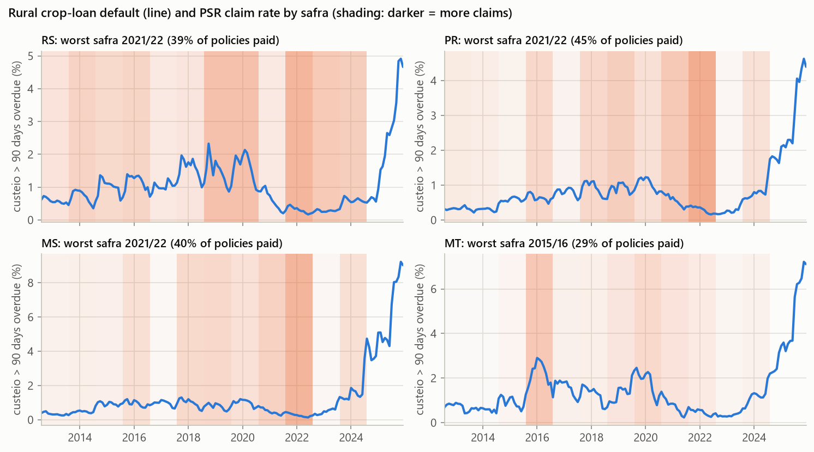

## Method

### Data and target
- **Policies:** PSR/SISSER (MAPA), one row per subsidized crop policy, 2006-2025.
  Name and CPF/CNPJ are dropped from each chunk while the CSV is streamed, before
  anything is written. 1,532,459 policies remain after cleaning ([DATA_CARD](DATA_CARD.md)).
- **Target:** policy indemnified (`VALOR_INDENIZAÇÃO > 0`).
- **Censoring:** the public files stop registering claims in early 2025 (policies
  starting in December 2024 have 0.09% claims; the 2025 file has none). A safra is
  used only if 98%+ of its policies ended their risk window 90+ days before the
  estimated claims cutoff. 2024/25 is out; the last test safra is 2023/24.
- **One source problem found and handled:** the 2016-2024 file is cut at the Excel
  row limit (1,048,565 rows); the insurer at the end of the file loses its 2020-2023
  rows, so that insurer is excluded from 2020 on ([DECISIONS D2](DECISIONS.md)).

### When does the weather matter? A crop calendar
Coverage dates in the PSR are contractual: soy cover often starts months before
planting and lasts 365 days. So each crop group gets a **critical window** from CONAB
crop calendars (e.g. soy in the South: Dec 1 + 105 days; second-crop corn: Mar 15 +
107 days; wheat in the South: Jul 1 + 122 days), and each policy gets the first
window that starts after its contract. On 2016+ policies the window falls inside
the real coverage period for 99% of soy and second-crop corn.

The safra (fold) is the Aug-Jul year of the window start, so summer soy, the
following second-crop corn and winter wheat of the same season share a fold.

### Features
| Block | What | Known when |
|---|---|---|
| Contract | crop, UF, insurer, product type, area, coverage level, sum insured/ha and expected yield relative to the previous safra's median, contract month, days to the critical window | contract |
| Portfolio history | past loss rate of the municipality x crop group, UF x crop group, crop group (only earlier safras, shrunk toward the next level, n >= 10) | contract |
| Climatology | 1981-2005 statistics of the policy's own critical window at its NASA POWER cell: normal rain, variability, drought frequency, dry spells, max 5-day rain, hot days, frost-risk days, soil moisture | contract |
| ENSO | latest published Oceanic Niño Index and its 3-month change | contract |
| Season weather | rain, dry spells, heat, frost and soil-moisture **anomalies** from the window start to its midpoint, plus the 30 days before | mid-window |

### Validation
- **Walk-forward by safra:** for each test safra from 2013/14 to 2023/24, train on
  all earlier safras and score the test safra (11 folds). Never a random split.
- **Hyperparameters** chosen once, on safras 2009-2012 (before every test safra),
  by mean AUC over those years.
- **Leakage audit:** indemnity, cause of loss, premium and rate are never features
  of the main models (unit-tested); history is computed as-of; the climatology
  period ends before the first policy (unit-tested); in-season features stop at the
  middle of the critical window.
- **Sensitivity:** a one-safra gap between training and test (claims of the last
  safra may still be open when the next one is priced) and a rolling 8-safra window.

## Production

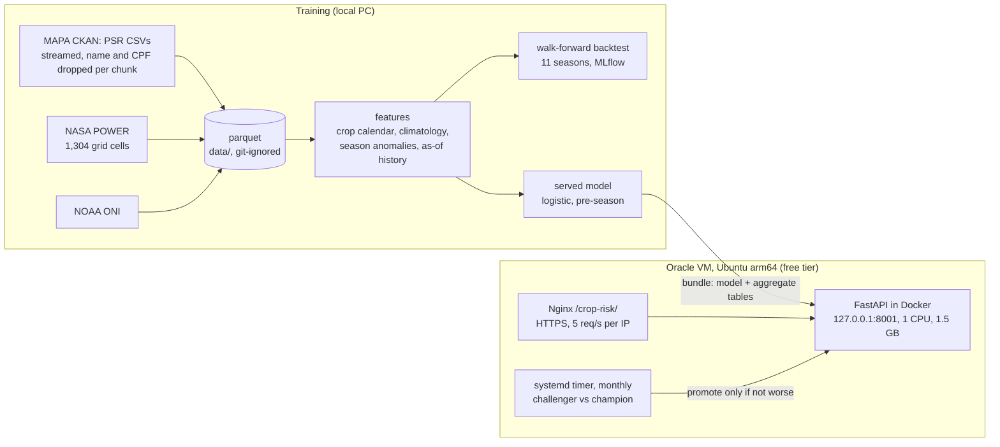

- **Endpoints:** `GET /` (form), `GET /health`, `GET /model-info` (version, training
  seasons, holdout metrics, data snapshot), `POST /predict` (validated input:
  crop, IBGE municipality code, contract date, area, sum insured, coverage, yields,
  optional insurer and rate), `/docs`. A prediction returns the probability, the
  risk decile against the latest complete season, the crop's critical window and the
  five largest contributions (exact for the linear model). If the insurer is not
  informed, the answer is the average over the main insurers weighted by market share.
- **Served model:** the logistic pre-season model. It had the best mean AUC of the
  contract-time candidates and the most stable ranking (worst season 0.56 vs 0.39
  for LightGBM). Holdout 2023/24 (never seen by the served model): AUC 0.629 vs 0.610
  for the rate, Brier 0.1411 vs 0.1406, score PSI 0.08.
- **Monthly retrain:** refreshes the PSR files (only if CKAN shows a change), the NASA
  POWER tail and ENSO, rebuilds the table, trains a challenger on all seasons but the
  latest complete one, and scores challenger and champion on that season. The
  challenger is promoted only if AUC is not lower by more than 0.002 and Brier not
  higher by more than 0.001, and the API must pass a health check after the swap;
  otherwise the champion stays. Each run appends metrics and PSI to `retrain.jsonl`. The first full cycle
  ran on the VM in 21 minutes.
- **Guardrails on the VM:** the container listens on 127.0.0.1 only, has CPU/memory
  limits and rotated logs; the retrain runs at night with `nice`/`ionice` and its own
  limits. Everything can be removed with [`deploy/ROLLBACK.md`](deploy/ROLLBACK.md).

## Limitations

- **Selection bias:** only federally subsidized policies. Subsidy budgets changed
  the size and mix of the portfolio from year to year; unsubsidized insurance and
  uninsured farms are not in the data.
- **Claims registration and censoring:** the files have no claim date and stop
  registering claims in early 2025. Seasons after 2023/24 are excluded; late claims
  of 2023/24 may still be missing. The production model always lags one complete
  season.
- **Source truncation:** the 2016-2024 file is cut at the Excel row limit; one
  insurer's 2020-2023 policies are lost ([DATA_CARD](DATA_CARD.md)).
- **Location:** climate comes from the municipality seat's 0.5° x 0.625° grid cell,
  not from the farm; hail and local storms are invisible at that scale.
- **Contract dates are not crop dates:** the critical windows come from a crop
  calendar by macro-region; late or early planting shifts the real window.
- **Few seasons:** 18 seasons, 11 of them for testing. One drought year moves the
  averages, and confidence intervals of most differences include zero.
- **ENSO leverage:** ENSO states seen in only a handful of training seasons move the
  pre-season prediction. In 2026/27 the ONI is +1.8 and rising, so this season's API
  scores are driven by ENSO more than usual.

## How to run

Requires [uv](https://docs.astral.sh/uv/) and Python 3.11.

```bash
make setup      # pinned dependencies (training extras + dev tools)
make data       # PSR (streamed, personal data dropped), NASA POWER, ONI; cleaning and censoring
make train      # features, tuning, walk-forward backtest, served model bundle
make evaluate   # tables and figures in reports/, SHAP
make inmet      # INMET vs NASA POWER study
make scr        # optional: claims vs rural-credit default
make test       # unit tests on a small synthetic fixture
make api        # API on http://127.0.0.1:8001
```

The first `make data` downloads about 500 MB from MAPA (streamed) and 1,304 NASA
POWER series (about 25 minutes). MLflow runs are stored in `mlruns/` (git-ignored):
`uv run mlflow ui --backend-store-uri sqlite:///mlruns/mlflow.db`.

## Repository

```
src/croprisk/
  data/        PSR streaming ingestion, NASA POWER cache, ONI, municipalities
  calendar.py  crop groups and critical windows
  dataset.py   cleaning, target, censoring
  features/    climate, history (as-of), market references, assembly
  backtest.py  walk-forward experiments, tuning
  evaluate.py  metrics, deciles, double lift, figures   explain.py  SHAP
  train.py     served model bundle                      retrain.py  champion/challenger
  serving/     FastAPI app, bundle loader, HTML form
  quality/     INMET vs NASA POWER                      analysis/   SCR.data study
deploy/        Dockerfile helpers, Nginx block, systemd timer, ROLLBACK.md
reports/       results, figures, cleaning and data-quality reports (aggregates only)
```

Decisions and their reasons: [DECISIONS.md](DECISIONS.md) · data:
[DATA_CARD.md](DATA_CARD.md) · model: [MODEL_CARD.md](MODEL_CARD.md).

## Data and privacy

Public data: MAPA (PSR/SISSER, CC-BY), NASA POWER, NOAA CPC, INMET, BCB SCR.data.
The policyholder's name and CPF/CNPJ are dropped while the CSV is streamed, before
anything is written; property coordinates are dropped too. No policy-level data is
in this repository; published tables and figures are aggregated, and the API bundle
only holds municipality-level rates built from at least 10 policies.

---
Caio Goia · [GitHub](https://github.com/caiogoia123) · [LinkedIn](https://www.linkedin.com/in/caio-goia)
