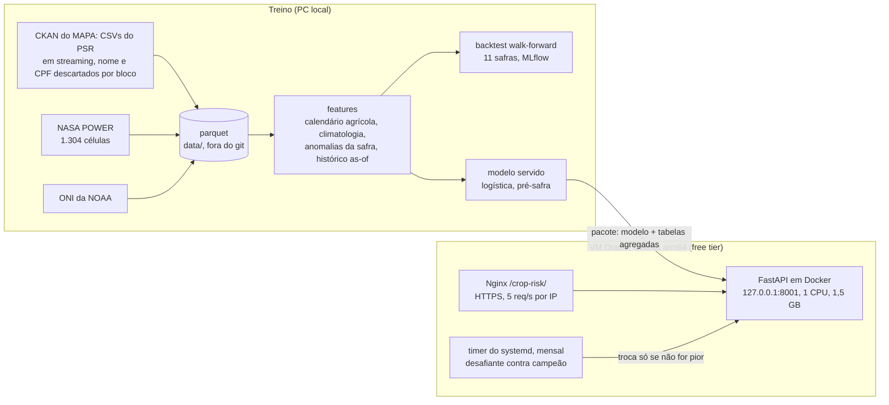

# Risco de sinistro no seguro rural no Brasil

[](https://github.com/caiogoia123/crop-insurance-risk/actions/workflows/ci.yml)
· [English](README.md)

Modelo de sinistro para 1,5 milhão de apólices de seguro rural subvencionadas (PSR,
2006-2024), com clima do NASA POWER, validação walk-forward por safra e uma API
rodando numa VM gratuita da Oracle.

## Resumo

**Pergunta:** dada uma apólice de seguro rural, qual a probabilidade de ela ser
indenizada? Quanto o clima melhora essa previsão em relação a usar só os dados do
contrato? O modelo ordena o risco melhor do que a taxa que a própria seguradora cobrou?

**Três números** (11 safras de teste, 2013/14 a 2023/24, 1.157.908 apólices; cada safra
é avaliada por modelos treinados só com safras anteriores):

1. **Modelo pré-safra contra a taxa da seguradora: AUC 0,646 contra 0,625.** O modelo
   ordena melhor em 7 de 11 safras, mas o ganho é pequeno: com o atraso realista de
   uma safra nos dados de sinistro ele fica em 0,635, e o intervalo de confiança inclui zero.
2. **O clima conhecido na contratação não acrescenta nada mensurável** (climatologia
   1981-2005 e ENSO: +0,002 de AUC). **O clima observado durante a safra acrescenta
   +0,06 de AUC** (LightGBM 0,695 contra 0,633, melhor em 10 de 11 safras).
3. **O modelo tem informação que o preço não tem.** Ordenando as apólices pelo risco do
   modelo dividido pelo risco implícito na taxa, a sinistralidade vai de **0,49** no
   primeiro decil a **1,45** no último, enquanto a taxa cobrada fica quase igual (6,5% a 9,5%).

**API:** https://caiogoia.duckdns.org/crop-risk/ (formulário) ·
[documentação](https://caiogoia.duckdns.org/crop-risk/docs) ·
[model-info](https://caiogoia.duckdns.org/crop-risk/model-info)

## Resultados

### Backtest

Walk-forward por safra (ano agrícola agosto-julho): cada safra de teste é avaliada por
modelos treinados com todas as safras anteriores; os hiperparâmetros foram escolhidos
uma vez, em 2009-2012. AUC, KS, Gini, PR-AUC e Brier são médias das 11 safras de teste.
"AUC dentro da cultura" ordena apólices do mesmo grupo de cultura e da mesma safra,
que é onde o preço da seguradora diferencia produtores.

| Modelo | AUC (dp) | pior safra | KS | PR-AUC | Brier | AUC dentro da cultura | safras > taxa |
|---|---|---|---|---|---|---|---|
| Taxa média (constante) | 0,500 | 0,500 | 0,000 | 0,168 | 0,1414 | 0,500 | - |
| **Taxa da seguradora (`PE_TAXA`)** | **0,625** (0,080) | 0,510 | 0,245 | 0,228 | **0,1388** | 0,579 | - |
| Logística, contrato + histórico | 0,644 (0,057) | 0,555 | 0,255 | 0,243 | 0,1405 | 0,585 | 7/11 |
| LightGBM, só contrato | 0,622 (0,084) | 0,505 | 0,205 | 0,224 | 0,1467 | 0,591 | 4/11 |
| LightGBM, contrato + histórico | 0,638 (0,085) | 0,487 | 0,225 | 0,247 | 0,1450 | **0,622** | 6/11 |
| **Logística, pré-safra (servido na API)** | **0,646** (0,058) | **0,562** | 0,248 | 0,245 | 0,1398 | 0,593 | 7/11 |
| LightGBM, pré-safra | 0,633 (0,111) | 0,391 | 0,273 | 0,248 | 0,1404 | 0,597 | 7/11 |
| LightGBM, pré-safra + taxa da seguradora | 0,643 (0,106) | 0,433 | 0,277 | 0,253 | 0,1397 | 0,606 | 7/11 |
| Logística, durante a safra | 0,683 (0,072) | 0,580 | 0,305 | 0,283 | 0,1338 | 0,624 | 9/11 |
| **LightGBM, durante a safra** | **0,695** (0,069) | 0,558 | **0,307** | **0,299** | 0,1344 | **0,663** | 9/11 |
| LightGBM, fim da janela crítica | 0,690 (0,073) | 0,595 | 0,298 | 0,294 | 0,1362 | 0,663 | 10/11 |

*Pré-safra* = contrato + histórico da carteira + climatologia + ENSO, tudo conhecido na
assinatura. *Durante a safra* = pré-safra + clima observado do início até a metade da
janela crítica da cultura (alerta antecipado). Gini = 2·AUC - 1. Tabelas completas,
diferenças pareadas com intervalo de confiança e testes de sensibilidade:
[`reports/results.md`](reports/results.md).


### O clima ajuda?

- **Clima conhecido na contratação: não.** Somar a climatologia 1981-2005 da janela
  crítica e o índice ENSO a contrato + histórico muda o AUC em +0,002 (logística,
  IC 95% de -0,008 a +0,011) e -0,005 (LightGBM). O histórico de sinistros do município
  já diz onde a seca costuma bater. O SHAP mostra que o LightGBM usa a climatologia
  (32% da atribuição), mas como substituto de localização e histórico, não como
  informação nova.
- **Clima observado na safra: sim.** Anomalias de chuva, veranico, calor, geada e
  umidade do solo até a metade da janela levam o AUC de 0,633 para 0,695 (LightGBM,
  10 de 11 safras, IC 95% de +0,004 a +0,122) e o lift do decil de maior risco de 1,6
  para 2,1. O ganho é maior nos anos de seca: em 2021/22 os modelos pré-safra caem para
  0,39-0,60 e o LightGBM durante a safra fica em 0,70.
- Por causa do sinistro (AUC dos sinistros daquela causa contra apólices sem sinistro):
  seca 0,61 pré-safra (logística) e 0,68 durante a safra; granizo 0,72-0,79 e geada
  0,77-0,79 com ou sem o clima da safra (dependem do que é plantado e onde, o que o
  contrato já diz); chuva excessiva 0,55 em todos os modelos.

### O modelo bate a taxa da seguradora?

- **Ordenação da carteira inteira: um pouco, sem consistência.** A logística servida
  tem média 0,646 contra 0,625 (+0,020, IC 95% de -0,010 a +0,052, 7 de 11 safras). A
  taxa ganha nas outras quatro (2015/16, 2016/17, 2017/18 e 2019/20). Com uma safra de intervalo entre treino e avaliação,
  mais próximo de como um preço é definido antes de os sinistros da última safra
  fecharem, a vantagem cai para +0,009 (0,635 contra 0,625, IC 95% de -0,024 a +0,042,
  ainda 7 de 11 safras).
- **Dentro de cada cultura: sim.** A taxa é definida sobretudo por cultura, região e
  produto; dentro do mesmo grupo de cultura e safra, o LightGBM com contrato + histórico
  chega a 0,622 contra 0,579 da taxa (café 0,74 contra 0,64, soja 0,63 contra 0,58).
- **Calibração: não.** A taxa, transformada em probabilidade por uma logística ajustada
  nas safras passadas, tem o melhor Brier entre os modelos da contratação (0,1388 contra 0,1398).
- **Sinal para precificação:** o double lift ordena as apólices pelo risco do modelo
  dividido pelo risco implícito na taxa. Onde o modelo vê mais risco do que o preço, o
  sinistro é três vezes mais frequente (28,4% contra 9,2%) e a sinistralidade é 1,45
  contra 0,49, com taxa cobrada parecida. Ou seja, o modelo carrega informação que o
  preço não tem.


### Lift, KS e sinistralidade por decil

Os decis são calculados dentro de cada safra e depois somados.


### Calibração: os modelos ordenam, não preveem a safra


O painel da esquerda junta todas as safras de teste; o da direita compara a taxa de
sinistro observada em cada safra com a média prevista. A taxa de sinistro varia de 7%
(2016/17) a 32% (2021/22). O modelo pré-safra não tem como saber o clima da safra; sua
previsão média acompanha em parte a safra anterior (previu 20% para 2016/17, que teve 7%,
e 23% para 2022/23, que teve 10%) por meio do histórico e do ENSO. O modelo durante a safra ordena bem a seca
de 2021/22 (AUC 0,70), mas ainda prevê 14,5% de sinistro médio numa safra de 32%: o
tamanho do choque é maior do que qualquer coisa que as árvores viram na mesma situação.
Use os scores para ordenar e sinalizar, não como previsão do total de sinistros da safra.

O PSI do score entre treino e teste passa de 0,25 na maioria das safras, nos dois
modelos. Aqui isso é esperado e não é defeito: cada safra tem um estado do ENSO, um mix
de culturas e um orçamento de subvenção diferentes (42 mil apólices em 2015/16, 199 mil
em 2021/22). O monitoramento deve comparar o PSI entre safras, não usar o alarme usual de 0,25.

### O que move os scores (SHAP, LightGBM, safra de teste 2023/24)


Pré-safra: cultura, seguradora, ENSO e histórico de sinistros do município lideram.
Durante a safra: a anomalia de chuva na primeira metade da janela entra entre as quatro
primeiras, e o clima da safra fica com 29% da atribuição.

## Qualidade dos dados climáticos: estações do INMET contra o NASA POWER

Os modelos usam o NASA POWER (produto em grade, sem falhas). Para mostrar por quê, e o
que isso custa, `croprisk.quality.inmet` compara o POWER com as 95 estações automáticas
do INMET no PR, SC e RS em 2021-2022:

- **As falhas são frequentes.** A estação mediana não tem total diário de chuva
  válido em 23% dos dias; 64 das 95 estações perdem mais de 10% dos dias.
- **Chuva zero ou falta de medição?** Um dia só conta como medido com 22 ou mais
  valores horários válidos; uma soma diária ingênua transforma horas faltantes em 0 mm
  e teria criado 21.779 dias-estação secos falsos, que um modelo leria como seca.
  Sequências de 30 ou mais dias com zero exato enquanto as vizinhas recebem 60 mm ou
  mais são marcadas como sensor travado (39 dias em 1 estação).
- **Preenchimento por vizinhas (IDW, potência 2, 150 km, 2 ou mais estações):**
  validado deixando cada dia medido de fora, erro médio absoluto de 2,8 mm/dia,
  correlação 0,77, viés total de +0,5%, 89% dos dias de chuva detectados. Preencheu
  19.428 dias-estação; 4.045 ficaram sem vizinhas com dado.
- **NASA POWER contra as estações:** correlação diária 0,75 (quase igual ao IDW das
  vizinhas), mensal 0,91; o POWER tem 8% menos chuva no total e mais dias de garoa (35%
  dos seus dias de chuva são secos na estação); correlação da temperatura mínima 0,95,
  viés -0,1 °C. Bom para anomalias da safra; não para trabalho diário no nível da fazenda.


## Extra: ondas de sinistro antecedem a inadimplência do crédito rural?

`croprisk.analysis.scr_credit` cruza a taxa de sinistro por UF e safra com a carteira
de custeio agrícola do SCR.data do BCB (jul/2012 a dez/2025). Em 100 combinações UF x
safra com 1.000 apólices ou mais, a taxa de sinistro não prevê a variação dos
empréstimos com mais de 90 dias de atraso doze meses depois (Spearman -0,12, p = 0,23;
dentro da UF -0,12, p = 0,22). Em 2021/22, a pior safra de sinistros, a inadimplência
estava caindo. O salto de 2024-2025 para 5% a 9% no RS, PR, MS e MT acompanha preços e
juros, não os sinistros do PSR. Uma razão provável: a indenização paga o banco, e a
dívida rural pode ser prorrogada depois de uma perda.


## Método

### Dados e alvo
- **Apólices:** PSR/SISSER (MAPA), uma linha por apólice de seguro rural subvencionada,
  2006-2025. Nome e CPF/CNPJ são descartados de cada bloco enquanto o CSV é lido em
  streaming, antes de qualquer gravação. Depois da limpeza ficam 1.532.459 apólices
  ([DATA_CARD](DATA_CARD.md)).
- **Alvo:** apólice indenizada (`VALOR_INDENIZAÇÃO > 0`).
- **Censura:** os arquivos públicos param de registrar sinistros no início de 2025
  (apólices que começam em dezembro de 2024 têm 0,09% de sinistro; o arquivo de 2025
  não tem nenhum). Uma safra só entra se 98% ou mais das apólices terminaram a
  janela de risco 90 dias antes da data de corte estimada. A 2024/25 fica fora; a
  última safra de teste é a 2023/24.
- **Um problema na fonte, encontrado e tratado:** o arquivo 2016-2024 foi cortado no
  limite de linhas do Excel (1.048.565 linhas); a seguradora no fim do arquivo perde
  as linhas de 2020 a 2023 e por isso sai a partir de 2020 ([DECISIONS D2](DECISIONS.md)).

### Quando o clima importa? Um calendário agrícola
As datas de vigência do PSR são contratuais: a cobertura da soja costuma começar
meses antes do plantio e durar 365 dias. Por isso cada grupo de culturas tem uma
**janela crítica** tirada dos calendários da CONAB (soja no Sul: 1º/dez + 105 dias;
milho safrinha: 15/mar + 107 dias; trigo no Sul: 1º/jul + 122 dias), e cada apólice
recebe a primeira janela depois da contratação. Nas apólices de 2016 em diante, a
janela cai dentro da vigência real em 99% dos casos de soja e milho safrinha.

A safra (o fold) é o ano agosto-julho do início da janela: soja de verão, o milho
safrinha seguinte e o trigo de inverno da mesma temporada ficam no mesmo fold.

### Variáveis
| Bloco | O que é | Conhecido quando |
|---|---|---|
| Contrato | cultura, UF, seguradora, tipo de produto, área, nível de cobertura, soma segurada/ha e produtividade esperada relativas à mediana da safra anterior, mês da contratação, dias até a janela crítica | contratação |
| Histórico da carteira | taxa de sinistro passada do município x grupo de cultura, UF x grupo, grupo (só safras anteriores, com encolhimento para o nível acima, n >= 10) | contratação |
| Climatologia | estatísticas 1981-2005 da janela crítica da própria apólice na célula do NASA POWER: chuva normal, variabilidade, frequência de seca, veranicos, chuva máxima em 5 dias, dias quentes, dias com risco de geada, umidade do solo | contratação |
| ENSO | último Índice Oceânico do Niño publicado e sua variação em 3 meses | contratação |
| Clima da safra | **anomalias** de chuva, veranico, calor, geada e umidade do solo do início da janela até a metade, mais os 30 dias anteriores | meio da janela |

### Validação
- **Walk-forward por safra:** para cada safra de teste de 2013/14 a 2023/24, treina
  em todas as safras anteriores e avalia na safra de teste (11 folds). Nunca split
  aleatório.
- **Hiperparâmetros** escolhidos uma vez, nas safras 2009-2012 (antes de qualquer
  safra de teste), pela média de AUC nesses anos.
- **Auditoria de vazamento:** indenização, evento causador, prêmio e taxa nunca são
  variáveis dos modelos principais (testado); o histórico é calculado "as-of"; o
  período da climatologia termina antes da primeira apólice (testado); as variáveis
  da safra param na metade da janela crítica.
- **Sensibilidade:** um intervalo de uma safra entre treino e teste (os sinistros da
  última safra ainda podem estar abertos quando a próxima é precificada) e janela
  móvel de 8 safras.

## Produção



- **Endpoints:** `GET /` (formulário), `GET /health`, `GET /model-info` (versão, safras
  de treino, métricas no holdout, retrato dos dados), `POST /predict` (entrada validada:
  cultura, código IBGE do município, data do contrato, área, soma segurada, cobertura,
  produtividades, seguradora e taxa opcionais), `/docs`. A resposta traz a probabilidade,
  o decil de risco contra a última safra completa, a janela crítica da cultura e as
  cinco maiores contribuições (exatas para o modelo linear). Sem a seguradora, a
  resposta é a média sobre as principais seguradoras, ponderada pela participação de mercado.
- **Modelo servido:** a logística pré-safra. Teve o melhor AUC médio entre os candidatos
  da contratação e a ordenação mais estável (pior safra 0,56 contra 0,39 do LightGBM).
  Holdout 2023/24 (nunca visto pelo modelo servido): AUC 0,629 contra 0,610 da taxa,
  Brier 0,1411 contra 0,1406, PSI do score 0,08.
- **Retreino mensal:** atualiza os arquivos do PSR (só se o CKAN mostrar mudança), o
  fim das séries do NASA POWER e o ENSO, reconstrói a tabela, treina um desafiante com
  todas as safras menos a última completa e avalia desafiante e campeão nessa safra. O
  desafiante só é promovido se o AUC não cair mais de 0,002 e o Brier não subir mais de
  0,001, e a API precisa passar no health check depois da troca; senão o campeão fica.
  Cada execução grava métricas e PSI em `retrain.jsonl`. O primeiro ciclo completo
  rodou na VM em 21 minutos.
- **Proteções na VM:** o container escuta só em 127.0.0.1, tem limite de CPU e memória
  e rotação de log; o retreino roda de madrugada com `nice`/`ionice` e limites próprios.
  Tudo pode ser removido com o [`deploy/ROLLBACK.md`](deploy/ROLLBACK.md).

## Limitações

- **Viés de seleção:** só apólices com subvenção federal. O orçamento da subvenção mudou
  o tamanho e o mix da carteira de um ano para outro; seguro sem subvenção e lavouras
  sem seguro não estão nos dados.
- **Registro de sinistros e censura:** os arquivos não têm data do sinistro e param de
  registrar sinistros no início de 2025. As safras depois de 2023/24 ficam fora; sinistros
  tardios de 2023/24 ainda podem faltar. O modelo em produção sempre fica uma safra atrás.
- **Arquivo truncado na fonte:** o arquivo 2016-2024 foi cortado no limite de linhas do
  Excel; as apólices de 2020-2023 de uma seguradora se perderam ([DATA_CARD](DATA_CARD.md)).
- **Localização:** o clima vem da célula de 0,5° x 0,625° da sede do município, não da
  fazenda; granizo e tempestades locais são invisíveis nessa escala.
- **Datas do contrato não são datas da lavoura:** as janelas críticas vêm de um
  calendário agrícola por macrorregião; plantio cedo ou tarde desloca a janela real.
- **Poucas safras:** 18 safras, 11 delas para teste. Um ano de seca move as médias, e os
  intervalos de confiança da maioria das diferenças incluem zero.
- **Peso do ENSO:** estados do ENSO vistos em poucas safras de treino movem a previsão
  pré-safra. Em 2026/27 o ONI está em +1,8 e subindo, então os scores da API nesta safra
  são puxados pelo ENSO mais do que o normal.

## Como rodar

Requer [uv](https://docs.astral.sh/uv/) e Python 3.11.

```bash
make setup      # dependências fixadas (extras de treino + ferramentas de dev)
make data       # PSR (streaming, dados pessoais descartados), NASA POWER, ONI; limpeza e censura
make train      # features, tuning, backtest walk-forward, pacote do modelo servido
make evaluate   # tabelas e gráficos em reports/, SHAP
make inmet      # estudo INMET contra NASA POWER
make scr        # opcional: sinistros contra inadimplência do crédito rural
make test       # testes com uma fixture pequena e sintética
make api        # API em http://127.0.0.1:8001
```

O primeiro `make data` baixa cerca de 500 MB do MAPA (em streaming) e 1.304 séries do
NASA POWER (cerca de 25 minutos). Os experimentos do MLflow ficam em `mlruns/` (fora do
git): `uv run mlflow ui --backend-store-uri sqlite:///mlruns/mlflow.db`.

## Repositório

```
src/croprisk/
  data/        ingestão em streaming do PSR, cache do NASA POWER, ONI, municípios
  calendar.py  grupos de cultura e janelas críticas
  dataset.py   limpeza, alvo, censura
  features/    clima, histórico (as-of), referências de mercado, montagem
  backtest.py  experimentos walk-forward, tuning
  evaluate.py  métricas, decis, double lift, gráficos   explain.py  SHAP
  train.py     pacote do modelo servido                 retrain.py  campeão/desafiante
  serving/     app FastAPI, carregador do pacote, formulário HTML
  quality/     INMET contra NASA POWER                  analysis/   estudo do SCR.data
deploy/        bloco do Nginx, timer do systemd, scripts, ROLLBACK.md
reports/       resultados, gráficos, relatórios de limpeza e qualidade (só agregados)
```

Decisões e seus porquês: [DECISIONS.md](DECISIONS.md) · dados:
[DATA_CARD.md](DATA_CARD.md) · modelo: [MODEL_CARD.md](MODEL_CARD.md) (em inglês).

## Dados e privacidade

Dados públicos: MAPA (PSR/SISSER, CC-BY), NASA POWER, NOAA CPC, INMET, SCR.data do BCB.
O nome e o CPF/CNPJ do segurado são descartados enquanto o CSV é lido em streaming,
antes de qualquer gravação; as coordenadas da propriedade também. Não há dado por
apólice neste repositório; tabelas e gráficos publicados são agregados, e o pacote da
API só tem taxas por município calculadas com pelo menos 10 apólices.

---
Caio Goia · [GitHub](https://github.com/caiogoia123) · [LinkedIn](https://www.linkedin.com/in/caio-goia)
